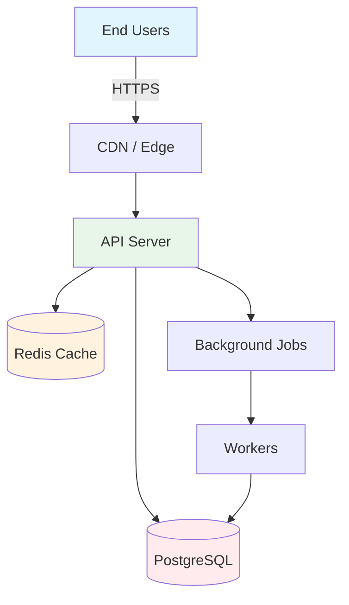
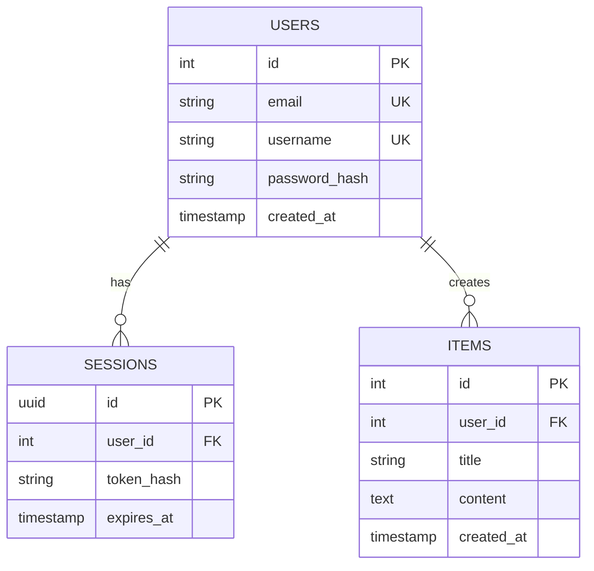

# Project Architecture: [Project Name]

## 1. Technical Context

**Description:** [2-3 sentences about the project essence]

**Key Requirements:**
- Support for [X] concurrent users
- API latency < [Y]ms
- Availability [Z]%
- Data storage: [size/type]

---

## 2. Technology Stack

### Frontend
- **Framework:** [Next.js 16 (React 19) / React 19 + Vite / Vue 3] + TypeScript
- **State Management:** [Zustand / Redux Toolkit / Context API]
- **Styling:** [Tailwind CSS / Shadcn UI]
- **Build Tool:** [Vite / Next.js]

**Justification:** [Why this stack? 2-3 sentences: ecosystem, team expertise, performance]

### Backend
- **Runtime/Framework:** [Next.js Server Actions + Route Handlers / Node 20 + Hono|Fastify / Python 3.12+ + FastAPI]
- **Database:** [PostgreSQL (Supabase|Neon) / MongoDB] (+ Redis cache if needed)
- **Authentication:** [Better Auth / Auth.js / JWT + HTTP-only cookies]
- **API Design:** [Server Actions / REST / tRPC / GraphQL]

**Justification:** [Why this stack? 2-3 sentences: performance, scalability, team expertise]

### Infrastructure
- **Deployment:** [Monolithic / Microservices]
- **Hosting:** [Vercel / Railway / DigitalOcean VPS / AWS]
- **CI/CD:** GitHub Actions
- **Monitoring:** Sentry (errors) + [Grafana / Datadog] (metrics)

**Justification:** [Why this infrastructure? 2-3 sentences: cost, reliability]

---

## 3. System Architecture

### High-Level Diagram

> EXAMPLE topology (self-hosted API + Redis + worker queue). Redraw for the CHOSEN stack — drop nodes the project doesn't have. A serverless Next.js MVP is usually just: Users → Vercel Edge/CDN → Server Actions/Route Handlers → Postgres (Supabase/Neon). No separate API server, no Redis, no worker unless justified.



**Data Flow:**
1. User requests → CDN (cached static content served directly)
2. Dynamic requests → API servers
3. API checks Redis cache before querying database
4. Long-running tasks → background job queue

---

## 4. Database Schema

### Entity Relationship Diagram



**Schema Design Principles:**
- Use indexes on columns in WHERE, JOIN, ORDER BY clauses
- Foreign keys with ON DELETE CASCADE for automatic cleanup
- Timestamps in UTC for consistency

---

## 5. Key Design Decisions

### 5.1 Authentication Strategy

> Fill this from the CHOSEN stack — do NOT default to hand-rolled JWT. Modern full-stack stacks ship a managed auth library; use it instead of building token logic by hand.
> - **Next.js + Better Auth / Auth.js** → library-managed sessions (cookie-based), OAuth providers, built-in CSRF. No manual JWT plumbing.
> - **Supabase** → Supabase Auth + Row Level Security.
> - **Separate API (Node/FastAPI) needing stateless tokens** → JWT (access + refresh) is reasonable. Document it only here, in that case.

**Decision:** [chosen mechanism, e.g. "Better Auth — cookie sessions + Google OAuth"]

**Why:**
- [2-3 reasons tied to the stack and PRD auth requirement]

**Implementation:**
- [Key points: session storage, provider config, role/permission model. For JWT only: access token in memory, refresh token in HTTP-only cookie, rotation on refresh.]

### 5.2 Caching Strategy

> Only add the layers the project NEEDS. An MVP on a serverless stack often needs ZERO Redis — CDN edge cache + framework data cache (e.g. Next.js fetch cache) is enough. Add Redis only when there's real DB-load or shared-state pressure. Don't bolt on Redis by reflex.

**Decision:** [chosen layers, e.g. "CDN edge cache + Next.js Data Cache; Redis deferred to post-MVP" OR "Browser → CDN → Redis" if justified]

**Why:**
- [reasons tied to actual load from the PRD/estimate]

**Rules:**
- [Per chosen layer: what's cached + TTL. Static assets: CDN (TTL 1 year). Add Redis rows only if Redis is in the stack.]

### 5.3 API Design

**Structure:**
```
/api/v1/
  /auth
    POST /register
    POST /login
    POST /refresh
  /users
    GET  /
    GET  /:id
    PUT  /:id
```

**Response Format:**
```json
{
  "success": true,
  "data": { ... },
  "meta": { "timestamp": "2025-01-15T10:30:00Z" }
}
```

---

## 6. Architecture Decision Records (ADR) Template

Use this template to document significant architectural decisions:

```markdown
### ADR-XXX: [Decision Title]

**Status:** [Proposed / Accepted / Deprecated]
**Date:** YYYY-MM-DD

**Context:**
[What forces are at play: business, technical, team constraints]

**Decision:**
[State the architectural decision clearly]

**Rationale:**
1. [Why this makes sense - numbered list]
2. [Key benefit]
3. [Another reason]

**Consequences:**
- ✅ [What becomes easier]
- ❌ [What becomes harder]

**Alternatives Considered:**
- [Option 1]: [Why not chosen]
- [Option 2]: [Why not chosen]
```

---

## 7. Security Measures

**Critical Security Checklist:**

- [ ] **Transport Security:** HTTPS only (TLS 1.3), HSTS header
- [ ] **Authentication:** Per the chosen auth mechanism (Section 5.1) — library-managed sessions for Better Auth/Supabase, or bcrypt 12-round hashing + JWT only for a separate stateless API
- [ ] **Input Validation:** Validate all user inputs (Zod or similar), sanitize HTML
- [ ] **SQL Injection Protection:** Parameterized queries only (ORM handles this)
- [ ] **XSS Protection:** HTTP-only cookies, CSP headers
- [ ] **Rate Limiting:** 100 req/min per IP, 1000 req/hour per user
- [ ] **Security Headers:** framework-native (Next.js `headers()` / middleware) or `helmet` for a self-hosted Node API

---

## 8. Performance Optimization

**Frontend:**
- Code splitting by route (React.lazy)
- Image optimization (WebP, lazy loading)
- Bundle size < 200KB initial load

**Backend:**
- Database connection pooling (max 20 connections)
- Query optimization (indexes on frequent queries)
- Response compression (gzip/brotli)
- API pagination (limit 100 items per page)

**Targets:**
- Lighthouse score: > 90
- API response time (p95): < 300ms
- Page load time: < 2s

---

## 9. Infrastructure Cost Estimation (MVP)

### Monthly Costs for MVP (< 1,000 users/day)

> Use the table matching the CHOSEN stack. Serverless is the 2026 default and is usually **~\$0/mo** at MVP scale.

**Default — modern serverless (Vercel + Supabase/Neon):**

| Component | Solution | Cost | Notes |
|-----------|----------|------|-------|
| **Hosting + Edge/CDN** | Vercel (Hobby/Pro) | \$0–20 | \$0 Hobby; Pro \$20 when needed |
| **Database** | Supabase / Neon free tier | \$0 | Paid from ~\$25 when it grows |
| **Auth** | Better Auth / Supabase Auth | \$0 | In-stack |
| **Storage** | Supabase Storage / S3 | \$0–1 | Free tier covers MVP |
| **Email** | Resend (free tier) | \$0 | 3k emails/mo free |
| **Monitoring** | Sentry (free tier) | \$0 | 5K errors free |
| **Total** | | **~\$0–30/month** | Scales with usage |

**Alternative — self-hosted VPS** (use only if the stack is a separate API / no serverless):

| Component | Solution | Cost | Notes |
|-----------|----------|------|-------|
| **Compute** | DigitalOcean Droplet (2GB) | \$12 | Single server |
| **Database** | Managed PostgreSQL (1GB) | \$15 | Automated backups |
| **Redis** (if used) | Redis Cloud (30MB free) | \$0 | Free tier |
| **Storage** | AWS S3 (10GB) | \$0.30 | Pay-as-you-go |
| **CDN** | CloudFlare Free | \$0 | Unlimited bandwidth |
| **Email** | Resend / SendGrid free | \$0 | Free tier |
| **Monitoring** | Sentry (5K errors) | \$0 | Free tier |
| **Total** | | **~\$27/month** | |

**Cost Optimization:**
- Use CDN aggressively (cache static assets) - saves 50-70% bandwidth
- Cache hot reads (framework data cache by default; Redis only if it's in the stack) - cuts DB load
- Optimize images (WebP) - saves 60% storage

**Scaling Strategy:**
- At 80% capacity → upgrade to 4GB server (\$24/month)
- At 10K users → add load balancer + second server

---

## 10. Monitoring & Logging

**Metrics to Track:**
- API response time (p50, p95, p99)
- Error rate (4xx, 5xx)
- Database query duration
- Active users

**Alerting:**
- Error rate > 5% for 5min → Critical alert
- API response time p95 > 500ms → Warning alert
- Database connection pool > 80% → Warning alert

**Logging:**
- Structured JSON logs
- Log levels: ERROR, WARN, INFO
- Centralized logging (Loki / CloudWatch)

---

## 11. Backup & Disaster Recovery

> Required — the Stage 2 checklist verifies this. Even an MVP needs an answer to "what happens when the database dies?".

**Database backups:**
- [Mechanism — e.g. Supabase/Neon automated daily backups + PITR, or `pg_dump` cron to object storage]
- Retention: [e.g. 7 daily + 4 weekly]
- Restore test: [how/when you verify a backup actually restores]

**Recovery targets:**
- **RPO** (max acceptable data loss): [e.g. 24h for MVP, <1h post-launch]
- **RTO** (max acceptable downtime): [e.g. a few hours for MVP]

**Failure handling:**
- DB outage → [managed-provider failover / read replica / documented manual restore]
- Bad deploy → [rollback path: Vercel instant rollback / re-deploy previous tag]
- Data corruption → restore from last good backup + replay

> MVP-honest: managed Postgres (Supabase/Neon) covers most of this out of the box — state that explicitly rather than over-engineering a custom DR plan.

---

## Status

**Status:** ✅ Ready for PLANNING Phase

**Next Steps:**
1. Review and approve this architecture
2. Proceed to PLANNING.md for sprint breakdown
3. Create TASKS.md with executable implementation tasks

---

**Document End**
