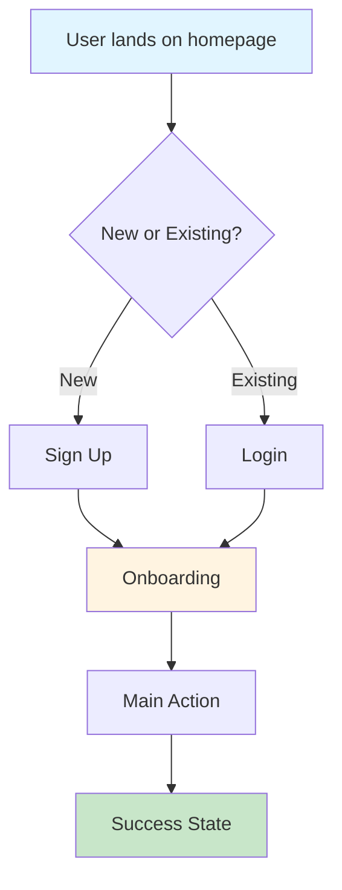

# Product Requirements Document (PRD): [Project Name]

## Document Information

- **Version:** 1.0
- **Last Updated:** [Date]
- **Author:** [Name] + Claude Full-Stack Architect
- **Status:** Draft / In Review / Approved

---

## 1. Executive Summary

**What:** [1-2 sentences describing what the product is]

**Why:** [1-2 sentences explaining why we're building this]

**Who:** [Target audience in 1 sentence]

**When:** [Timeline: MVP in X weeks/months]

---

## 2. Problem Statement

### Current Situation
**What problem are we solving?**

[Describe the pain point or gap in the market. Be specific with user frustrations.]

### User Personas

| Persona | Role | Goals | Pain Points |
|---------|------|-------|-------------|
| **[Name]** | [Role] | [Main goals] | [Current frustrations] |

---

## 3. Goals & Success Metrics

### Business Goals
**Primary Goal:** [What business outcome do we want?]

### Success Metrics (KPIs)

| Metric | Target | Measurement |
|--------|--------|-------------|
| **Activation Rate** | [%] of signups create first [action] within 24h | Analytics |
| **Retention (D7)** | [%] of users return after 7 days | Cohort analysis |
| **Engagement** | Average user [key action] X times/week | Analytics |

---

## 4. Target Audience

**Who are they?**
- [Demographics: age, location, occupation]
- [Psychographics: tech-savvy level, budget]
- [Current behavior: how they solve problem today]

---

## 5. Core Features (MVP Scope)

### Must-Have Features (P0)

#### Feature 1: [Name]
- **Description:** [What it does]
- **User Story:** As a [role], I want to [action] so that [benefit]
- **Acceptance Criteria:**
  - [ ] [Specific testable criterion]
  - [ ] [Specific testable criterion]

#### Feature 2: [Name]
- **Description:** [What it does]
- **User Story:** As a [role], I want to [action] so that [benefit]
- **Acceptance Criteria:**
  - [ ] [Specific testable criterion]

### Nice-to-Have Features (P1)
- [Feature name]: [Brief description]
- [Feature name]: [Brief description]

### Future Features (P2)
- [Feature name]: [Brief description]

---

## 6. User Flow (Main Journey)

---

## 7. Non-Functional Requirements

### Performance
- Page Load Time: < 2 seconds
- API Response Time: < 200ms (p95)
- Uptime: 99.9%

### Security
- Authentication: [auth requirement, not implementation — e.g. "email + OAuth login, role-based access". Pick the concrete mechanism at Stage 2 from the chosen stack — do NOT hardcode JWT here]
- Data Encryption: TLS 1.3 for transport
- Rate Limiting: [X] req/min per user

### Scalability
- Concurrent Users: Support [X] simultaneous users
- Database: Handle [X] records

---

## 8. Business Model

### Pricing Strategy

| Plan | Price | Features | Target |
|------|-------|----------|--------|
| **Free** | \$0 | [Core features] | [Audience] |
| **Pro** | $[X]/month | [All features] | [Audience] |

---

## 9. Technical Constraints

### Budget
- Development: $[X] (or: self-funded)
- Infrastructure: $[X]/month
- Marketing: $[X]/month

### Team
- [Number] developers
- [Technologies team knows]

### Technology Preferences
**Must Use:** [Tech stack based on team expertise]

**Avoid:** [Technologies team doesn't know or too complex]

---

## 10. Timeline & Milestones

| Phase | Duration | Goal |
|-------|----------|------|
| MVP Development | [X] weeks | Functional MVP |
| Beta Testing | [X] weeks | Product-market fit |
| Public Launch | [X] weeks | [X] signups |

---

## 11. Risks & Mitigation

| Risk | Impact | Probability | Mitigation |
|------|--------|-------------|------------|
| [Risk description] | High/Medium/Low | High/Medium/Low | [Strategy] |

---

## Status & Next Steps

**Status:** ✅ Ready for Architecture Phase

**Next Steps:**
1. Review and approve this PRD
2. Clarify any open questions
3. Proceed to ARCHITECTURE.md (STAGE 2)

---

**Document End**
